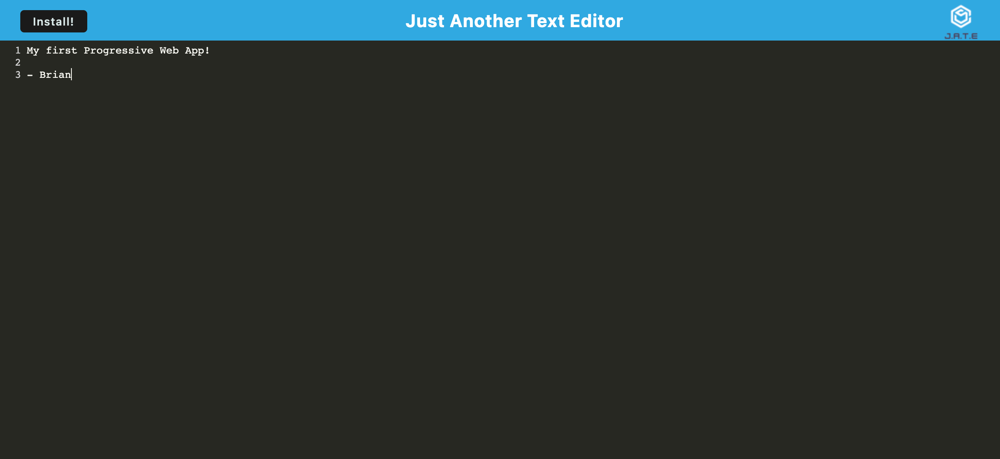

# Progressive-Web-App-Text-Editor

[](https://opensource.org/licenses/ISC)

## Description

This single-page application is a text editor that runs in the browser meets the PWA criteria. Additionally, it features a number of data persistence techniques that serve as redundancy in case one of the options is not supported by the browser. The application also functions offline. I utilized [IDB Database](https://developer.mozilla.org/en-US/docs/Web/API/IDBDatabase) for data persistence, [Express](https://expressjs.com/),[Concurrently](https://www.npmjs.com/package/concurrently) for running commands concurrently, [Babel](https://babeljs.io/) for Javascript compiling , [Webpack](https://webpack.js.org/) as my module bundler , [Webpack PWA Manifest](https://www.npmjs.com/package/webpack-pwa-manifest) to auto-generate my manifest.json, [Workbox Webpack Plugin](https://www.npmjs.com/package/workbox-webpack-plugin) to generate my servie workers and this application a PWA.

## Table of Contents

- [Installation](#installation)
- [Usage](#usage)
- [Product](#product)
- [Questions](#questions)
- [Technology](#technology)
- [License](#license)

## Installation

Prerequisites: Node & NPM

```bash
git clone https://github.com/brianbixby/Progressive-Web-App-Text-Editor.git
cd Progressive-Web-App-Text-Editor
npm run install
```

## Usage

- The application will be invoked by using the following commands:

```bash
npm run start:dev OR npm run start 
*** open http://localhost:3000/ ***

```

## Product




## Questions

If you have any questions please don't hesitate to reach out:
[Github](https://github.com/brianbixby)
[Email](mailto:brianbixby0@gmail.com)

## Technology

- [Github](https://github.com/brianbixby/Progressive-Web-App-Text-Editor)
- [Nodejs](https://nodejs.org/en/)
- [Express](https://expressjs.com/)
- [IDB Database](https://developer.mozilla.org/en-US/docs/Web/API/IDBDatabase) 
- [Concurrently](https://www.npmjs.com/package/concurrently)
- [Babel](https://babeljs.io/) 
- [Webpack](https://webpack.js.org/)
- [Webpack PWA Manifest](https://www.npmjs.com/package/webpack-pwa-manifest) 
- [Workbox Webpack Plugin](https://www.npmjs.com/package/workbox-webpack-plugin)

## License

Copyright 2022 Brian Bixby

Permission to use, copy, modify, and/or distribute this software for any purpose with or without fee is hereby granted, provided that the above copyright notice and this permission notice appear in all copies.

THE SOFTWARE IS PROVIDED "AS IS" AND THE AUTHOR DISCLAIMS ALL WARRANTIES WITH REGARD TO THIS SOFTWARE INCLUDING ALL IMPLIED WARRANTIES OF MERCHANTABILITY AND FITNESS. IN NO EVENT SHALL THE AUTHOR BE LIABLE FOR ANY SPECIAL, DIRECT, INDIRECT, OR CONSEQUENTIAL DAMAGES OR ANY DAMAGES WHATSOEVER RESULTING FROM LOSS OF USE, DATA OR PROFITS, WHETHER IN AN ACTION OF CONTRACT, NEGLIGENCE OR OTHER TORTIOUS ACTION, ARISING OUT OF OR IN CONNECTION WITH THE USE OR PERFORMANCE OF THIS SOFTWARE.